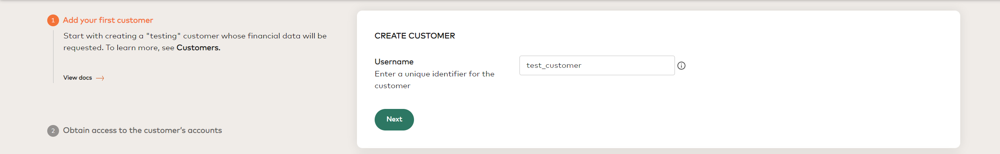
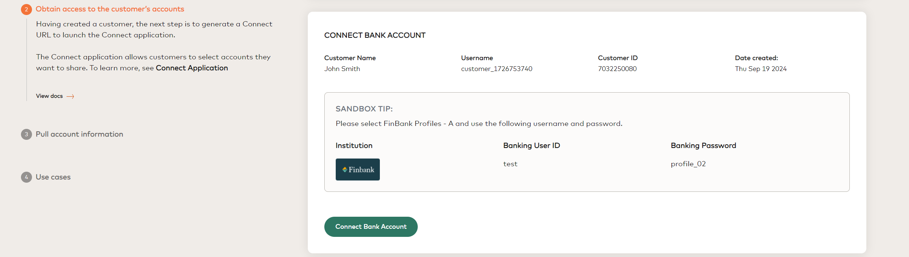

# Open Banking Reference Application

[](https://sonarcloud.io/summary/new_code?id=Mastercard_open-banking-reference-application)


[](https://sonarcloud.io/summary/new_code?id=Mastercard_open-banking-reference-application)
[](https://sonarcloud.io/summary/new_code?id=Mastercard_open-banking-reference-application)
[](https://sonarcloud.io/summary/new_code?id=Mastercard_open-banking-reference-application)


## Table of Contents

-   [Overview](#overview)
    -   [Compatibility](#compatibility)
    -   [Installation](#Installation)
    -   [References](#references)
-   [Steps](#steps)
    1. [Generate your credentials](#1-generate-your-credentials)
    2. [Add credentials in the .env file](#2-add-credentials-in-the-env-file)
    3. [Run application](#3-run-application)
    4. [Create your first customer](#4-create-your-first-customer)
    5. [Add a bank account to customer](#5-add-a-bank-account-to-customer)
    6. [Pull account information](#6-pull-account-information)

## Overview

The Open Banking reference app is a sample app to [Mastercard's Open Banking APIs](https://developer.mastercard.com/product/open-banking/) where users can explore examples of how Connect and other APIs can be implemented into their applications. The reference app will allow you to create test customers and also seek permission to access test account data from one or more of their test accounts. Please note that applications accessing the Open Banking APIs must be hosted within the United States.

### Compatibility

-   **Node (v14+)**
-   **ReactJS (v18.2.21)**

This application is built using the ReactJS framework. ReactJS requires Node version 14+.
However, It is recommended that you use one of NodeJS's LTS releases or one of the [more general recent releases](https://github.com/nodejs/Release). A Node version manager such as [nvm](https://github.com/creationix/nvm) (Mac and Linux) or [nvm-windows](https://github.com/coreybutler/nvm-windows) can help with this.

### Installation

Before using the open banking reference application, you will need to set up a project in the local machine.
The following commands will help you to get the latest code and install the required dependencies on your machine.

```shell
git clone https://github.com/Mastercard/open-banking-reference-application.git
```

```shell
cd open-banking-reference-application && npm i
```

### References

-   [Test API ](https://developer.mastercard.com/open-banking-us/documentation/test-the-apis/)
-   [API Documentation](https://developer.mastercard.com/open-banking-us/documentation/connect/)
-   [Connect Web SDK](https://developer.mastercard.com/open-banking-us/documentation/connect/connect-implementation/)

## Steps

### 1. Generate your credentials

Follow the steps mentioned in the document to [generate your credentials](https://developer.mastercard.com/open-banking-us/documentation/quick-start-guide/#1-generate-your-credentials).


#### Instructions to create a Mastercard Developers project:

-   Login to [Mastercard developer's portal](https://developer.mastercard.com/product/open-banking/)
-   Log in and click the Create Project button at the top of this page
-   Select Open Banking and follow the step-by-step instructions
-   Take note of your Partner ID, Partner Secret and App Key. These will be required in the following sections.

### 2. Add credentials in the .env file

Open banking reference application needs Sandbox API credentials added in the .env file to make the API calls. 

-   Create the `.env` file.
    ```shell
     cp .env.template .env
    ```
-   Update the `.env` file with your Sandbox API credentials generated in step 1.

### 3. Run application

Run the following command to start the application.

```shell
npm start
```


### 4. Create your first customer



### 5. Add a bank account to customer

Now that you have a **Customer ID**, the next step is to add a bank account.


### 6. Pull account information


## Steps to run test cases

The following command will execute the test cases and show the status of each test.

```shell
npm run test
```


## Steps to be performed for creating application build

This step is required only when the application needs to be deployed on the server.

Run the following command to create the application build.

```
npm run build
```

Refer to the below code snippet for creating an [express](https://www.npmjs.com/package/express) application.
In addition to that we are using [http-proxy-middleware](https://www.npmjs.com/package/http-proxy-middleware) for handling proxy requests to open banking APIs or you can set up your proxy server for managing CORS (cross-origin-resource-sharing).

```
const express = require('express');
const {createProxyMiddleware} = require('http-proxy-middleware');
const app = express();
const port = process.env.PORT || 4000;

app.use(express.static('build'));
app.use(
    ['/aggregation/**', '/connect/**'],
    createProxyMiddleware({
      target: 'https://api.finicity.com',
      changeOrigin: true,
    })
  );
app.listen(port, () => {
  console.log(`Example app listening on port ${port}`);
});
```

## Contact Us
If you have any issues or concerns, please click [here](https://github.com/Mastercard/open-banking-reference-application/issues/new) to submit an issue and our team will get back to you as soon as possible.

