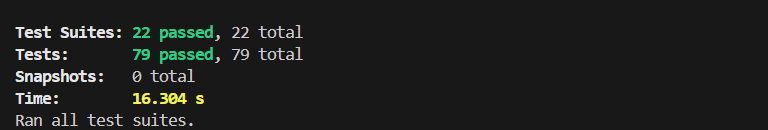
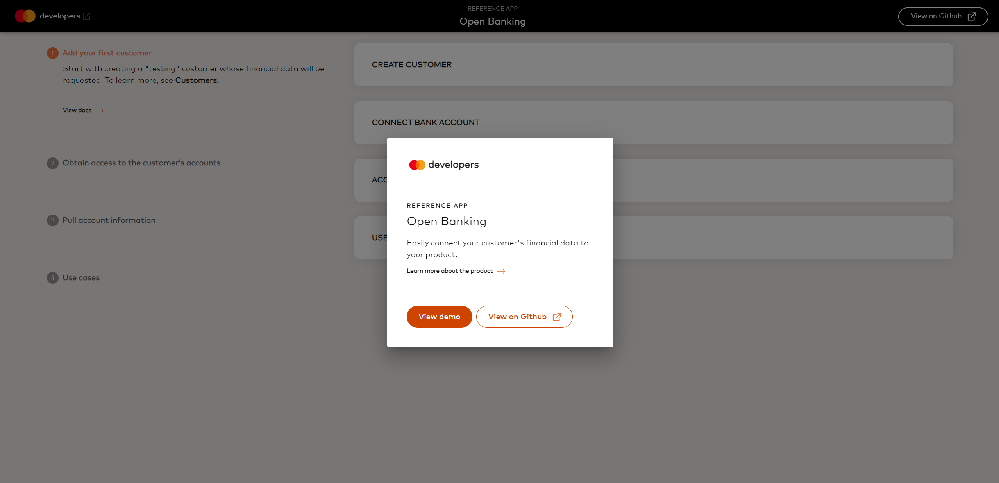
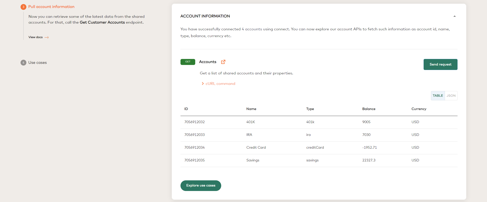
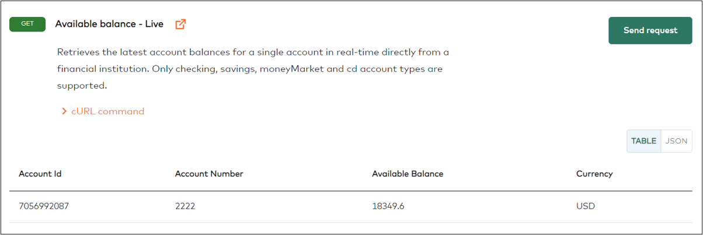
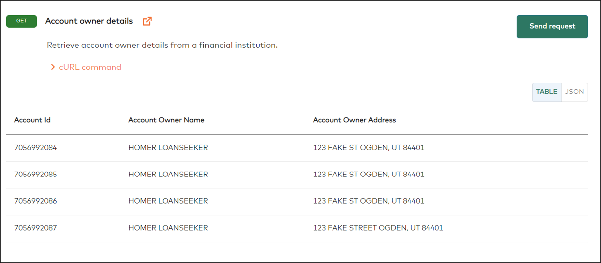

# Open Banking Reference Application

[](https://sonarcloud.io/summary/new_code?id=Mastercard_open-banking-reference-application)

[](https://sonarcloud.io/summary/new_code?id=Mastercard_open-banking-reference-application)
[](https://sonarcloud.io/summary/new_code?id=Mastercard_open-banking-reference-application)
[](https://sonarcloud.io/summary/new_code?id=Mastercard_open-banking-reference-application)
[](https://sonarcloud.io/summary/new_code?id=Mastercard_open-banking-reference-application)

## Table of Contents

-   [Overview](#overview)
    -   [References](#references)
-   [Set up](#set-up)
    -   [Compatibility](#compatibility)
    -   [Installation](#installation)
    -   [Test](#test)
-   [Demo](#demo)
    1. [Generate your credentials](#1-generate-your-credentials)
    2. [Add credentials in the .env file](#2-add-credentials-in-the-env-file)
    3. [Setup and run the application](#3-setup-and-run-the-application)
    4. [Create your first customer](#4-create-your-first-customer)
    5. [Add a bank account to customer](#5-add-a-bank-account-to-customer)
    6. [Pull account information](#6-pull-account-information)
    7. [Explore usecases](#7-usecases)
-   [Hosting Reference App](#hosting-reference-app)
-   [Contact Us](#contact-us)

## Overview

The Open Banking Reference App allows you to explore [Mastercard's Open Banking Service (MOBS)](https://developer.mastercard.com/open-banking-us/documentation/) to incorporate it into your product. This application allows you to:

-   Create test customers
-   Retrieve the data from the shared accounts
-   Explore the solutions offered by Mastercard Open Banking

> **IMPORTANT**: Please note that applications accessing the Mastercard Open Banking APIs must be hosted within US.

### References

-   [Test API ](https://developer.mastercard.com/open-banking-us/documentation/test-the-apis/)
-   [API Reference](https://developer.mastercard.com/open-banking-us/documentation/api-reference/)
-   [Connect Web SDK](https://developer.mastercard.com/open-banking-us/documentation/connect/connect-implementation/)

## Set up

### Compatibility

-   **Node (v14+)**
-   **ReactJS (v18.3.1)**

This application is built using the React framework. React requires Node version 14+.
However, It is recommended that you use one of NodeJS's LTS releases or one of the [more general recent releases](https://github.com/nodejs/Release). A Node version manager such as [nvm](https://github.com/creationix/nvm) (Mac and Linux) or [nvm-windows](https://github.com/coreybutler/nvm-windows) can help with this.

### Installation

Before using the Reference App, you will need to set up a project in the local machine.
The following commands will help you to get the latest code:

```shell
git clone https://github.com/Mastercard/open-banking-reference-application.git

cd open-banking-reference-application
```

### Test

You can run the following command to execute the test cases against the latest version of the Reference App:

```shell
npm run test
```



## Demo

### 1. Generate your credentials

-   Login to the [Mastercard developer's portal](https://developer.mastercard.com/product/open-banking/)
-   Log in and click the **Create New Project** button at the top left of the page.
-   Enter your project name and select Open Banking as the API service, then click on the **Proceed** button.
-   Select **United States of America** in the Commercial Countries drop down list, and click on the **Proceed** button.
-   Enter a description of your project on the next page, and click on the **Create Project** button.
-   Take note of your Partner ID, Partner Secret and App Key. These will be required in the following sections.

For more details see [Onboarding](https://developer.mastercard.com/open-banking-us/documentation/onboarding/).


### 2. Add credentials in the .env file

The Open Banking Reference App needs Sandbox API credentials adding to the `.env` file to make the API calls:

1. Create the `.env` file.
    ```shell
     cp .env.template .env
    ```
2. Update the `.env` file with your Sandbox API credentials generated in step 1.
3. The default value of `REACT_APP_AUTO_CREATE_CUSTOMER` is set to `false`. If the customer creation needs to be initated automatically then the value should be set to `true`

### 3. Setup and run the application

-   ##### Run without docker
    The following command will install the required depdendancies on your machine. (This command should be executed during the initial setup)
    ```
    npm i
    ```
    Execute the following command to start the Reference App:
    ```shell
    npm start
    ```
-   ##### Run with docker

    **Pre-requisites** - Docker installed and running on your machine: https://docs.docker.com/get-docker/

    The following command will create the docker image of the application and will start the application.

    ```
    docker compose up
    ```

When the application is launched in a browser, it prompts either to proceed with demo or go to GitHub. Select **View Demo**.
This will redirect you to the first step of the user flow.



### 4. Create your first customer

-   To access any financial data, first you need to create a customer.
    -   This can be done either manually or automatically, depending on `REACT_APP_AUTO_CREATE_CUSTOMER` flag value in the `.env` file.
        If `REACT_APP_AUTO_CREATE_CUSTOMER` is set to `false`, application will prompt you to provide a unique identifier for the customer. To proceed further, select **Next**.


If the `REACT_APP_AUTO_CREATE_CUSTOMER` is set to `true` then the customer will be created automatically.


### 5. Add a bank account to customer

Now that you have a **Customer ID**, the next step is to add a bank account. The screen lists a name of the Financial Institution and credentials to use during Connect flow.
To start, select **Connect Bank Account**:


This flow is a simulation of what a customer will see when they share their financial data.
In Connect flow:

1. Search for **FinBank Profiles - A**.
2. Click **Next**.
3. Type test and profile_02 when asked for a username and password.
4. Select all accounts, and then click **Save**.
5. Click **Submit**.

<p align="center">
  
</p>

### 6. Pull account information

At this point having customer ID allows you to retrieve the financial data. The Reference App shows examples of how to retrieve following data elements with the help of Mastercard open banking API's:

1. Account ID
2. Account name
3. Account type
4. Balance
5. Currency



### 7. Usecases

The use cases section provides you with an overview of the different solutions offered by Mastercard Open Banking.

-   **Lend**
    -   Investigate the ways of generating and obtaining the lending reports, including Verification of Assets, Verification of Income and Cash Flow Report etc. MOBS solution allows you to obtain these reports in  
        both PDF and JSON format.


-   **Manage**
    -   Lean how to request the transaction details for a particular account and data it contains.


-   **Pay**
    -   Discover how to obtain the key elements of the customers account required to initiate a payment, such as ACH details and available balance.






## Hosting Reference App

To host the Reference App on your server, run the following command to create the application build:

```
npm run build
```

Refer to the below code snippet for creating an [express](https://www.npmjs.com/package/express) application. Note, that to handling proxy requests to MOBS APIs, we are using [http-proxy-middleware](https://www.npmjs.com/package/http-proxy-middleware). Alternatively, you can set up your proxy server for managing CORS (cross-origin-resource-sharing).

```
const express = require('express');
const {createProxyMiddleware} = require('http-proxy-middleware');
const app = express();
const port = process.env.PORT || 4000;

app.use(express.static('build'));
app.use(
    ['/aggregation', '/connect', '/decisioning'],
    createProxyMiddleware({
        target: 'https://api.finicity.com/',
        changeOrigin: true,
    })
);

app.listen(port, () => {
  console.log(`Example app listening on port ${port}`);
});
```

## Contact Us

Have issues or concerns regarding the application?
Please create an issue in the GitHub and our team will try to address the issue as soon as possible.
